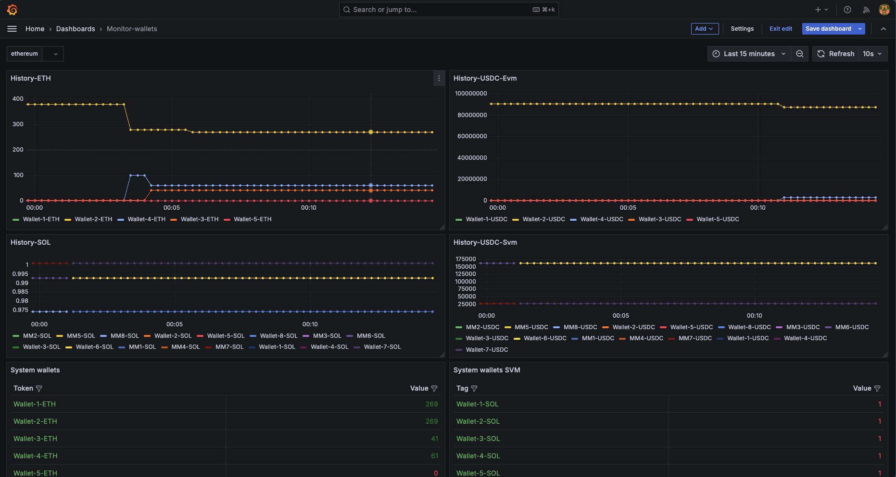

# Grafana Wallet Tracker

A simple plugin for tracking balances of wallets across different networks.

## Overview

This plugin allows you to track the balances of a list of wallets across different networks. It currently supports tracking balances for the following networks:

* Solana
* Ethereum

## Configuration

To use this plugin, you need to create a configuration file in the following format:
